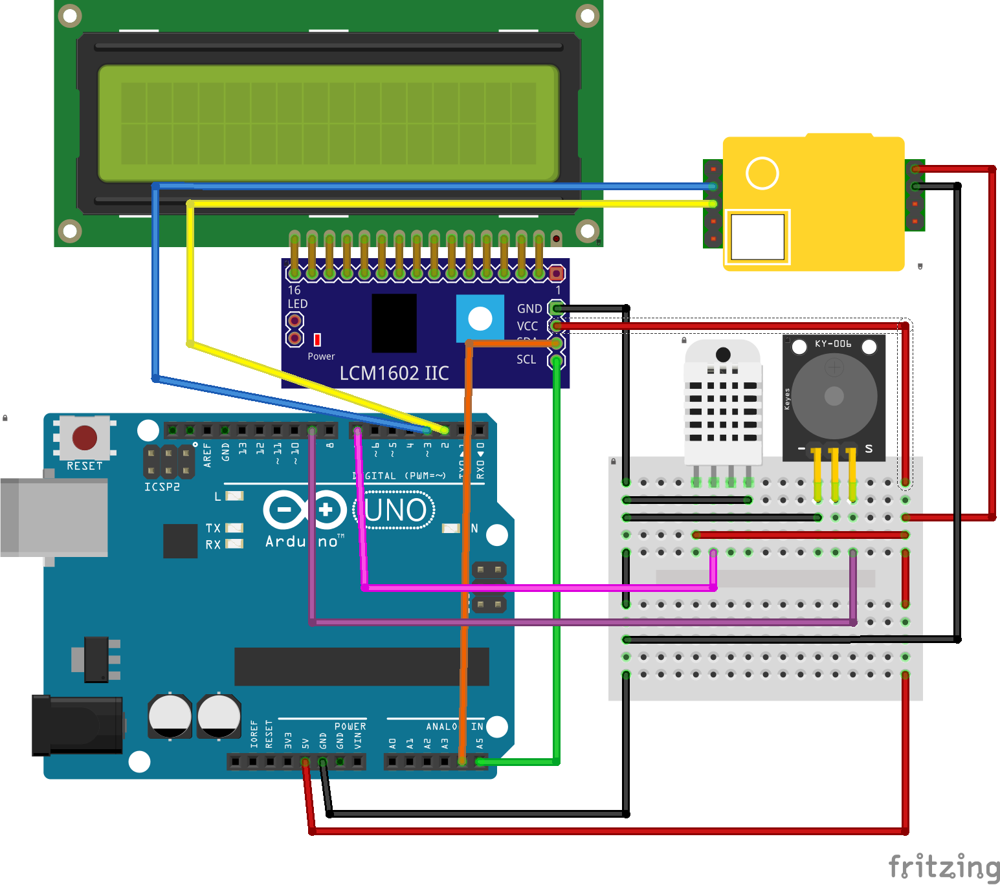

# CO2-detector
For better office air quality.

The detector will alarm you when the CO2 concentration is high enough to make you sleepy.

## Wiring

__Note__: The temperature and humidity sensor in the diagram is DHT22 and it is possible to replace it with DHT11 for lower costs.
In order to using DHT11, you have to edit the definition macro from `#define DHTTYPE DHT22` to `#define DHTTYPE DHT11`.

## Required Libraries
The following libraries are necessary for reading sensor data and displaying.
* __LiquidCrystal I2C__ by Marco Schwartz
* __DHT sensor library__ by Adafruit

Both are available in Arduino IDE library manager.
